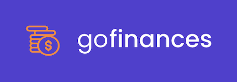
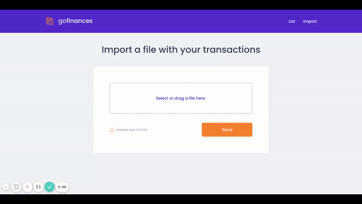

<p align="left">
   
</p>

# Go Finances

> An web application to control your finances! :)

[](https://github.com/jennifertakagi)
[](#)
[](https://github.com/jennifertakagi/go-finances/stargazers)
[](https://github.com/jennifertakagi/go-finances/network/members)
[](https://github.com/jennifertakagi/go-finances/graphs/contributors)

---

# :pushpin: Table of Contents

* [Features](#rocket-features)
* [UI Documentation](#framed_picture-ui-documentation)
* [Installation](#construction_worker-installation)
* [Getting Started](#runner-getting-started)
* [FAQ](#postbox-faq)
* [Found a bug? Missing a specific feature?](#bug-issues)
* [Contributing](#tada-contributing)
* [License](#closed_book-license)

<br />

# :rocket: Features

* Import your outcomes and incomes as CSV file
* Discover the outcome and income sum, and your total

# :framed_picture: UI Documentation
This project has a UI Documentation of reusable components, allowing to test them individually.

<p align="left">
   
</p>

# :construction_worker: Installation

**You need to install [YARN](https://yarnpkg.com/) and [DOCKER](https://www.docker.com/), then in order to clone the project via HTTPS, run this command:**

```git clone https://github.com/jennifertakagi/go-finances.git```

SSH URLs provide access to a Git repository via SSH, a secure protocol. If you have a SSH key registered in your Github account, clone the project using this command:

```git clone git@github.com:jennifertakagi/go-finances.git```


# :runner: Getting Started

Go to **backend** and **web** folders and check the README to start each project.

# :postbox: Faq

**Question:** What are the technologies used in this project?

**Answer:** The technologies used in this project are [React JS](https://pt-br.reactjs.org/), [Styled-Components](https://styled-components.com/), [Docker](https://www.docker.com/), [Node JS](https://nodejs.org/en/).

# :bug: Issues

Feel free to **file a new issue** with a respective title and description on the [Go Finances](https://github.com/jennifertakagi/go-finances/issues) repository. If you already found a solution to your problem, **i would love to review your pull request**! Have a look at our [contribution guidelines](https://github.com/jennifertakagi/go-finances/blob/master/CONTRIBUTING.md) to find out about the coding standards.

# :tada: Contributing

Check out the [contributing](https://github.com/jennifertakagi/go-finances/blob/master/CONTRIBUTING.md) page to see the best places to file issues, start discussions and begin contributing.

# :closed_book: License

Released in 2020.
This project is under the [MIT license](https://github.com/jennifertakagi/go-finances/master/LICENSE).

